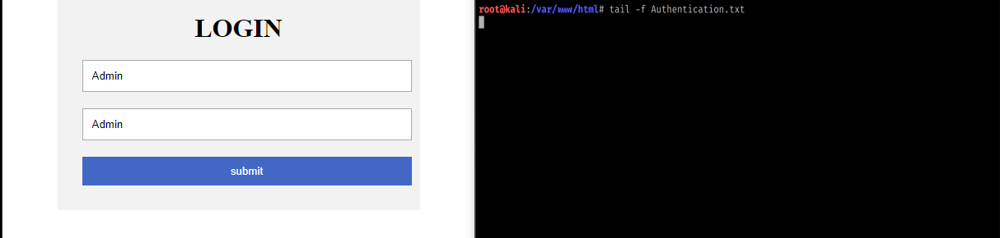
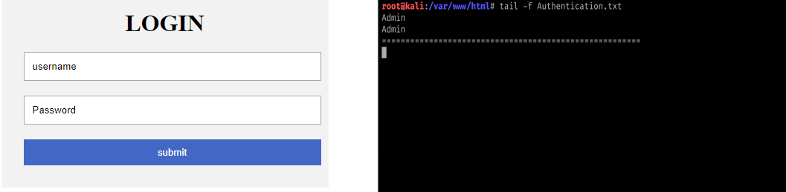

# Phishing-Landing-Page
Landing Page for phishing emails to capture credentials without additional services/frameworks being installed. 

To get this working, Start up a web server to host the page on. Ensure that the index.php page loads as the default page. Once confirmed that the index.php page loads first ensure that the Authentication.txt file site in the same directory as the index.php script then host the webs erver and test. 

1) Ensure your web server is up and running.

2) Ensure the index.php script loads as deafult.

3) Ensure that the Authentication.txt file is sitting in the same directory.

4) Test and verify that the script works. 

